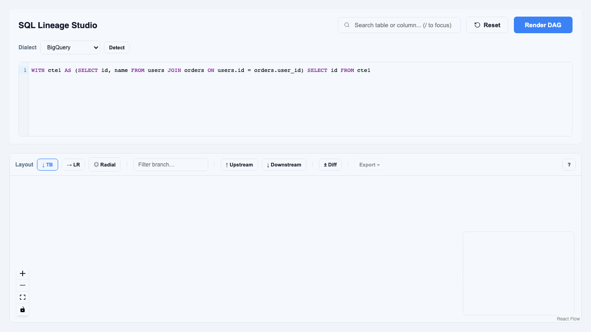
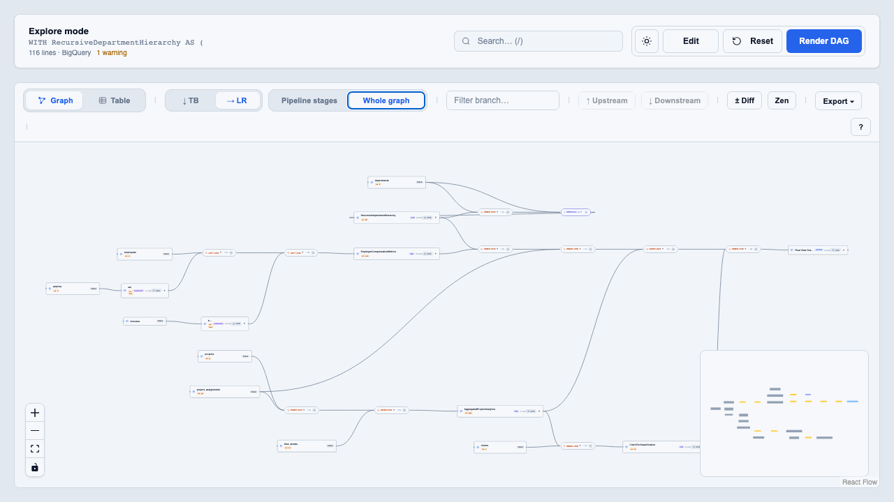
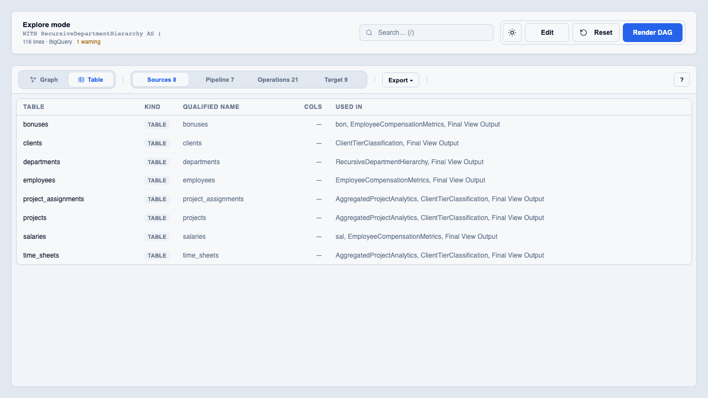

# SQL Lineage Studio (QueryFlow)

Untangle massive, complex SQL queries in seconds. SQL Lineage Studio is an interactive visualization tool that converts nested CTEs, subqueries, and multi-statement SQL into a clean, navigable data lineage graph (DAG).

Built for data engineers and analysts who need to debug long, production-grade queries without losing context.

  

## Demo







To re-record: [docs/assets/README.md](docs/assets/README.md) — `cd scripts && npm run record` (backend + UI must be running).

---

## Features

### Core lineage graph

- **Interactive DAG layout** — Parses SQL and renders a directional graph with `dagre` and React Flow.
- **CTE & subquery support** — Each CTE, subquery, and final output is a distinct node with correct upstream wiring.
- **Join condition extraction** — Join nodes show `ON` / `USING` conditions; expand to read full join logic.
- **Per-join nodes** — Separate join steps with type preserved (`LEFT JOIN`, `INNER JOIN`, etc.) and order in the chain.
- **Multi-dialect parsing** — Powered by SQLGlot (BigQuery default; Postgres, Snowflake, Spark, and others supported server-side).
- **Complex SQL preprocessing** — Handles patterns like `LATERAL` joins with parse warnings surfaced in the UI.

### Lineage accuracy

- **Node kinds** — Visual badges for `TABLE`, `CTE`, `SUBQUERY`, `VIEW`, `OUTPUT`, `INSERT`, `MERGE`, and more.
- **Qualified names** — Supports `schema.table` and `database.schema.table` where present in SQL.
- **Column-level lineage** — Output columns include upstream source references via SQLGlot’s lineage API.
- **Column trace mode** — Expand a node and click **trace** on any column to highlight its upstream path and source tables.
- **DML / DDL statements** — Lineage for `SELECT`, `INSERT`, `CREATE VIEW`, and `MERGE`.

### Graph interaction

- **Lineage highlighting** — Click a node to highlight upstream and downstream paths; unrelated nodes dim.
- **Upstream hide/show** — Hide upstream dependencies per node without re-layout (positions stay stable).
- **Smart search** — Find tables, columns, or lineage source names; press `Enter` to cycle through matches.
- **Branch filter** — Filter the graph to paths involving a specific table or CTE name.
- **Focus branch** — Show only upstream or only downstream of the selected node.
- **Breadcrumb path** — See the lineage path to the selected node (e.g. `users → join → cte1 → Final_Output`).
- **Collapsed columns by default** — Nodes show a column count; expand to inspect schema and lineage.
- **Interactive minimap** — Draggable, zoomable minimap with color coding matching node types.
- **Fit view for large graphs** — Auto-fit on render with deep zoom-out for complex queries.

### Layout & comparison

- **Layout modes**
  - **TB** — Top-to-bottom (default)
  - **LR** — Left-to-right
- **Graph / Table view** — Toggle in the graph toolbar (`G` / `T`); table has Sources, Pipeline, Operations, and Output tabs
- **Diff mode** — Compare two renders of the same query; new nodes and edges highlighted in green.
- **Reset canvas** — Restore full visibility, collapse state, and layout in one click.

---

## Getting started

**Default:** run the **backend** and **frontend** in separate terminals (no Docker required).  
**Optional:** single-container Docker for a demo or local “all-in-one” deploy — see section 3.

### Prerequisites

- Node.js 18+ (recommended)
- Python 3.10+

### 1. Backend (FastAPI)

```bash
cd /path/to/hackathon

python -m venv venv
source venv/bin/activate   # Windows: venv\Scripts\activate

pip install -r requirements.txt
uvicorn main:app --reload
```

API runs at **http://127.0.0.1:8000**  
OpenAPI docs: **http://127.0.0.1:8000/docs**

### 2. Frontend (React)

```bash
cd sql-visualizer-ui

npm install
npm run dev
```

Open **http://localhost:5173**

The dev server calls the API at **http://127.0.0.1:8000** by default (backend and UI on different ports). To point at another host, set `sql-visualizer-ui/.env`:

```env
VITE_API_URL=http://127.0.0.1:8000
```

### 3. Docker (optional — single container)

Runs the API and built UI together. No separate frontend dev server.

**Prerequisites:** Docker with Compose v2

```bash
cd /path/to/hackathon

docker compose -f deploy/docker-compose.yml up --build
```

Or from `deploy/`:

```bash
cd deploy && docker compose up --build
```

Open **http://localhost:8080** (maps to port 8000 inside the container).

The UI uses same-origin API calls in this mode (`VITE_API_URL` is empty at build time). Health check: **http://localhost:8080/health**

For local dev with hot reload, use sections 1 and 2 — Docker is not required.

### 4. Run tests

```bash
pytest
```

---

## User guide

This section explains how the UI behaves in practice — especially features that look similar but work differently.

### UI layout

| Area | What it controls |
|------|------------------|
| **Header** (top) | SQL editor, **Render DAG**, **Reset**, and **search** |
| **Graph toolbar** (above canvas) | Layout, **Filter branch**, focus, diff mode, **Export** |
| **Canvas** | Interactive graph — pan, zoom, click nodes |
| **Breadcrumb** (below toolbar) | Path to the selected node; shows `column: …` when tracing a column |

After **Render DAG**, the graph is laid out automatically. Node positions stay stable when you hide branches or filter — the graph does not jump unless you change layout mode or render again.

### Export

After rendering, use **Export ▾** in the graph toolbar:

| Format | Use case |
|--------|----------|
| PNG / SVG / PDF | Share or print the current graph view |
| JSON | Full versioned lineage contract + SQL metadata |
| CSV | Flattened nodes and edges for spreadsheets |
| OpenLineage | Marquez-compatible lineage event JSON |

API equivalents for CI/CD: `POST /api/v1/lineage`, `/api/v1/export/json`, `/api/v1/export/csv`, `/api/v1/export/openlineage`. Embed docs: [docs/EMBED.md](docs/EMBED.md).

### Dialect selector

Use the **Dialect** dropdown above the SQL editor before **Render DAG**. The choice is sent to the API on every parse (`read=` dialect for SQLGlot).

| Dialect | Notes |
|---------|--------|
| **BigQuery** | Default; best for `QUALIFY`, `ARRAY`, `STRUCT`, GoogleSQL |
| **Snowflake** | Snowflake functions and `QUALIFY` |
| **PostgreSQL** | `::` casts, Postgres functions |
| **Spark** | `LATERAL VIEW`, `EXPLODE` |
| **Redshift** | Postgres-family; `DISTKEY` / `SORTKEY` hints |
| **DuckDB** | `read_csv` / `read_parquet` style queries |

**Detect** runs keyword heuristics on your SQL and suggests a dialect (with confidence and matched signals). It is a hint, not a guarantee — pick the engine you are actually targeting.

Editor syntax highlighting uses the closest CodeMirror SQL dialect (BigQuery/Snowflake → standard SQL; Postgres/Redshift/DuckDB → PostgreSQL-style). Limitations per dialect are shown as the dropdown option tooltip from the API.

### Explore & Zen modes

After a **successful Render DAG**, the UI switches to **Explore mode**: the SQL editor collapses to a slim summary bar so the graph uses most of the screen. Use **Edit SQL** or **`E`** to open the full editor (**Author mode**). Use **Back to Explore** or **`E`** again to return to the graph **without re-rendering** (shows the last successful parse). If you edited SQL without rendering, Explore shows **SQL changed — Render to update**.

| Mode | What you see |
|------|----------------|
| **Author** | Full SQL editor, dialect, errors/warnings |
| **Explore** | Summary bar + graph toolbar + breadcrumb |
| **Zen** (within Explore) | Graph only + floating Fit / Edit / Exit Zen |

- **Zen** — toolbar and breadcrumb hidden; minimap off. Toggle with the **Zen** button or `Z`. Exit with **Exit Zen**, `Z`, or `Esc`.
- **Parse errors** keep you in Author mode so you can fix SQL.

---

### Search vs Filter branch

These are **two separate controls**. They are easy to confuse because both narrow what you see on the graph.

#### Search (header — “Search table or column…”)

- **Location:** Top bar, next to Reset / Render DAG. Press `/` to focus.
- **Matches:**
  - Node id, label, and qualified name (table/CTE names)
  - **Column names** on any node
  - Column lineage source references
  - Join conditions on join nodes
- **Behavior:**
  - Matching nodes get an amber highlight and glow.
  - Matching columns are highlighted when the node expands (matching nodes auto-expand).
  - The graph shows matching nodes **plus their full upstream and downstream paths**.
  - Pans to the first match as you type.
  - Press **Enter** to cycle through matches (`1 / N` counter shown).
- **Examples:** `project_name`, `project_id`, `clients`, `Aggregated`

#### Filter branch (toolbar — “Filter branch…”)

- **Location:** Graph toolbar, between layout buttons and ↑ Upstream / ↓ Downstream.
- **Matches only node names** — **not** columns:
  - Node `id` (e.g. `clients`, `AggregatedProjectAnalytics`)
  - `label` (display name on the card)
  - `qualified_name` (e.g. `schema.table` when the parser extracted it)
- **Does not match:** column names, `INNER JOIN` text, SQL inside nodes.
- **Behavior:**
  - For each matching node, shows that node and **everything upstream and downstream** of it.
  - Other nodes and edges are hidden (not deleted — still in the full graph).
  - Does **not** relayout; positions stay the same.
  - Red **No matches** if the text matches no node names (full graph stays visible).
- **Examples that work:** `clients`, `time_sheets`, `Aggregated`
- **Examples that do not work:** `project_id`, `project_name` (those are columns — use header search)

| You type | Header search | Filter branch |
|----------|---------------|---------------|
| `clients` | Yes | Yes |
| `project_id` | Yes (column) | No |
| `INNER JOIN` | Maybe (conditions) | No |

**Tip:** If header search is active, branch filter changes are ignored until you clear search.

---

### Selecting nodes and paths

**Click a node** to select it:

- Upstream and downstream paths are highlighted; other nodes dim.
- The **breadcrumb** shows the longest upstream path to that node, e.g. `departments → join → RecursiveDepartmentHierarchy → …`.

**↑ Upstream** / **↓ Downstream** (toolbar or `U` / `D`):

- Requires a selected node.
- **Upstream:** only nodes that feed into the selection (plus the selection).
- **Downstream:** only nodes fed by the selection (plus the selection).
- Stacks with **Filter branch** if both are active.
- **Clear focus** or **Esc** restores normal view (branch filter still applies if set).

---

### Column trace

1. Expand a node (▼ on the card).
2. Click **trace** next to a column name.

The UI highlights the upstream path for that column and marks likely source tables. The breadcrumb shows `column: <name>`. This is separate from search — it uses parsed column lineage from SQLGlot.

---

### Hide upstream (per node)

Nodes with incoming edges show a **HIDE** button:

- Hides upstream dependencies for **that node only** (collapse branch).
- Does **not** relayout — the node stays where it is.
- Click **HIDDEN** to show upstream again.

Use this when a large source table clutters the view but you still want to see how a CTE or output is wired.

---

### Layout modes

| Mode | Key | Best for |
|------|-----|----------|
| **↓ TB** | `1` | Default — vertical flow, reading top-to-bottom |
| **→ LR** | `2` | Wide queries — horizontal flow |

Changing layout **re-runs dagre** and may move nodes. Use **F** or **Reset** if the canvas feels off after a layout change.

---

### Diff mode (± Diff)

Compare **two renders** of SQL and see **structural** changes to the lineage graph.

#### How to use

1. Turn on **± Diff** in the toolbar.
2. Click **Render DAG** — this snapshot becomes the **baseline** (no green styling yet).
3. Edit the SQL and click **Render DAG** again.
4. New nodes and edges vs the baseline are highlighted in **green**.

#### What is compared

Comparison is by **node id** and **edge id** only:

| Change | On canvas | In toolbar summary |
|--------|-----------|-------------------|
| **Added** node | Green border, glow, **NEW** badge | `+N nodes` |
| **Added** edge | Green, thicker stroke | `+N` edges (in summary) |
| **Removed** node/edge | Not drawn (current graph only) | `−N removed` |

#### Limitations

- **Renames** look like one node removed and one added (ids differ).
- **Column-only changes** (e.g. add a column to `SELECT`) may show **no** green if node ids are unchanged.
- Removed items are counted but not ghosted on the canvas.

Turn **± Diff** off to clear the baseline. **Reset** also clears the baseline when diff mode is on.

---

### Reset vs Render DAG

| Action | Effect |
|--------|--------|
| **Render DAG** | Parse current SQL, rebuild graph, apply layout |
| **Reset** | Clear filters, focus, selection, collapse/hide state; relayout from stored base graph |

Search query is cleared on **Render DAG**, not on **Reset** alone — use **R** for reset canvas behavior per shortcuts modal.

---

### Keyboard shortcuts

| Key | Action |
|-----|--------|
| `/` | Focus header search |
| `F` | Fit graph to view |
| `R` | Reset canvas |
| `Esc` | Clear selection and focus |
| `U` | Focus upstream of selected node |
| `D` | Focus downstream of selected node |
| `1` | Layout: top-to-bottom |
| `2` | Layout: left-to-right |
| `?` | Show shortcuts help |
| `Enter` | Cycle search matches (while search box is focused) |

---

### Parse warnings and errors

**Warnings** (amber panel) — non-fatal issues from the preprocessor or parser (e.g. LATERAL normalized). The graph may still render; review before trusting lineage.

**Errors** (red panel) — fatal parse failures. No graph update. Each error shows **Line / Col** from SQLGlot when available. **Click an error** to jump the editor cursor to that position. **Dismiss** clears the panel; editing SQL also clears errors.

Invalid SQL example: `SELECT FROM` → click the error line to land on the typo.

---

### Quick workflow example

1. Paste SQL → **Render DAG**.
2. Type `clients` in **Filter branch** to see only paths involving that table.
3. Clear filter → click **AggregatedProjectAnalytics** → press `U` to focus upstream.
4. Expand the node → **trace** on `project_name` for column lineage.
5. Type `project_name` in **header search** (not filter branch) to find all nodes with that column.
6. Turn on **± Diff**, render, edit SQL, render again to see new tables/joins.

Try `backend/tests/fixtures/notworking.sql` for a stress test (recursive CTEs, lateral joins, `MERGE`, `ROLLUP`, etc.).

---

## Usage tips (quick reference)

1. Paste SQL and click **Render DAG**.
2. **Columns** → header search (`/`). **Table/CTE names** → Filter branch or search.
3. **trace** on a column for lineage highlight; **Hide** on a node to collapse upstream clutter.
4. **F** to fit large graphs; **R** to reset the canvas view.

---

## Tech stack

| Layer | Technologies |
|-------|----------------|
| **Frontend** | React 18, Vite, [@xyflow/react](https://reactflow.dev/), [dagre](https://github.com/dagrejs/dagre) |
| **Backend** | Python 3.10+, [FastAPI](https://fastapi.tiangolo.com/), [SQLGlot](https://github.com/tobymao/sqlglot), Pydantic |
| **API** | REST v1 under `/api/v1/*` — versioned JSON with nodes, edges, warnings, stats, and column lineage (`GET /api/v1/version` for contract metadata) |

### Project structure

```
backend/
  api/routes/                 # API routes
  models/                     # Pydantic schemas
  services/                   # AST → graph, dialects, parse errors
  tests/
    fixtures/                 # SQL fixtures (e.g. notworking.sql)
    test_*.py

sql-visualizer-ui/
  src/components/             # Graph canvas, toolbar, nodes
  src/hooks/                  # Lineage graph & layout logic
  src/utils/                  # Dagre layout, diff, path utilities
  src/api/                    # API clients

deploy/
  Dockerfile                  # Multi-stage image (UI + API)
  docker-compose.yml          # Local single-container run

docs/
  CATALOG.md                  # Metadata catalog integration (phased design)
  EMBED.md                    # iframe / API embed
  ENTERPRISE_ROADMAP.md       # Enterprise / production backlog

main.py                       # FastAPI entrypoint (uvicorn main:app)
pytest.ini
requirements.txt
readme.md
```

---

## Roadmap

Enterprise and production hardening items are tracked in [ENTERPRISE_ROADMAP.md](docs/ENTERPRISE_ROADMAP.md).

**Completed:** architecture refactor, lineage accuracy (section 4), advanced graph UX (section 9).

**Planned:** catalog integration (phased design in [docs/CATALOG.md](docs/CATALOG.md)), workspace save/share, auth, observability, and production deployment (K8s/Helm — see `docs/ENTERPRISE_ROADMAP.md`). Local Docker: `docker compose -f deploy/docker-compose.yml up --build`.

---

## License

See repository license. Contributions welcome.
